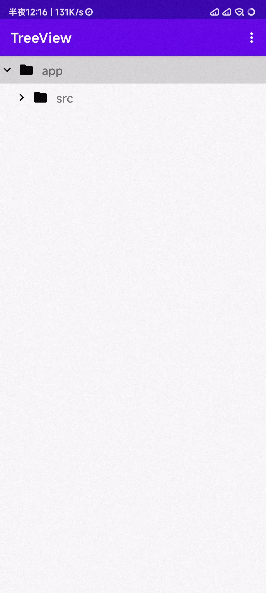

## TreeView

## Maintainers Needed！See [#12](https://github.com/dingyi222666/TreeView/issues/12) for more details.

An TreeView implement in Android with RecyclerView written in kotlin.

[](https://github.com/dingyi222666/TreeView/tree/main/.github/workflows/android.yml)

[](https://github.com/dingyi222666/TreeView/blob/main/LICENSE)

## Features

1. 100% written in kotlin.
2. Customise, ~~in the future~~ you can implement your own tree data structure.
3. Fetching data asynchronously(Lazy load), no need to load all data at once.
4. Horizontal scroll support. ~~(with bug)~~
5. Built-in DSL

## Screenshot




## TODO

- [x] Select or Deselect Node
- [x] Better TreeNodeGenerator API
- [ ] More API to operate the node in the tree, such as expand, collapse, etc.
- [x] Draggable nodes

## Usage

- Add the dependency to your gradle file

```groovy
implementation("io.github.dingyi222666:treeview:1.3.2")
```

- Use the `DataSource` DSL to create tree used for the TreeView. Also you can [use the `TreeNodeGenerator`](https://github.com/dingyi222666/TreeView/issues/4) to create the tree.

```kotlin
private fun createTree(): Tree<DataSource<String>> {
    val dataCreator: CreateDataScope<String> = { _, _ -> UUID.randomUUID().toString() }
    return buildTree(dataCreator) {
        Branch("app") {
            Branch("src") {
                Branch("main") {
                    Branch("java") {
                        Branch("com.dingyi.treeview") {
                            Leaf("MainActivity.kt")
                        }
                    }
                    Branch("res") {
                        Branch("drawable") {

                        }
                        Branch("xml") {}
                    }
                    Leaf("AndroidManifest.xml")
                }
            }
        }
    }
}
```

- Create a node binder to bind the node to the layout, and in most case also implement node click
  events in this class

  Note: For the indentation setting of the item, we recommend using a Space widget placed at the visual leftmost of your item layout. 
- The width of this widget is the indentation width of the item.

```kotlin
inner class ViewBinder : TreeViewBinder<DataSource<String>>(),
    TreeNodeEventListener<DataSource<String>> {

    override fun createView(parent: ViewGroup, viewType: Int): View {
        return if (viewType == 1) {
            ItemDirBinding.inflate(layoutInflater, parent, false).root
        } else {
            ItemFileBinding.inflate(layoutInflater, parent, false).root
        }
    }

    override fun getItemViewType(node: TreeNode<DataSource<String>>): Int {
        if (node.isChild) {
            return 1
        }
        return 0
    }

    override fun bindView(
        holder: TreeView.ViewHolder,
        node: TreeNode<DataSource<String>>,
        listener: TreeNodeEventListener<DataSource<String>>
    ) {
        if (node.isChild) {
            applyDir(holder, node)
        } else {
            applyFile(holder, node)
        }

        val itemView = holder.itemView.findViewById<Space>(R.id.space)

        itemView.updateLayoutParams<ViewGroup.MarginLayoutParams> {
            width = node.depth * 22.dp
        }

    }

    private fun applyFile(holder: TreeView.ViewHolder, node: TreeNode<DataSource<String>>) {
        val binding = ItemFileBinding.bind(holder.itemView)
        binding.tvName.text = node.name.toString()
    }

    private fun applyDir(holder: TreeView.ViewHolder, node: TreeNode<DataSource<String>>) {
        val binding = ItemDirBinding.bind(holder.itemView)
        binding.tvName.text = node.name.toString()

        binding
            .ivArrow
            .animate()
            .rotation(if (node.expand) 90f else 0f)
            .setDuration(200)
            .start()
    }


    override fun onClick(node: TreeNode<DataSource<String>>, holder: TreeView.ViewHolder) {
        if (node.isChild) {
            applyDir(holder, node)
        } else {
            Toast.makeText(this@MainActivity, "Clicked ${node.name}", Toast.LENGTH_LONG).show()
        }
    }

    override fun onToggle(
        node: TreeNode<DataSource<String>>,
        isExpand: Boolean,
        holder: TreeView.ViewHolder
    ) {
        applyDir(holder, node)
    }
}

```

- If you want to implement horizontal scrolling, you need to set the `supportHorizontalScroll` to
  true

```kotlin
treeview.supportHorizontalScroll = true
```

- Now you can create the tree structure and set up the node generator and node binder for the
  TreeView, and then call `refresh()` to load the data

```kotlin
 val tree = createTree()

(binding.treeview as TreeView<DataSource<String>>).apply {
    bindCoroutineScope(lifecycleScope)
    this.tree = tree
    binder = ViewBinder()
    nodeEventListener = binder
}

lifecycleScope.launch {
    binding.treeview.refresh()
}

```

- If you want to load dynamic data (etc. local file), you can see this example
  [here](./app/src/main/kotlin/com/dingyi/treeview/FileActivity.kt)


- Done! Enjoy using it.

## Special thanks

- [Rosemoe](https://github.com/Rosemoe) (Help improve the TreeView horizontal scrolling support)
- [HackerMadCat/Multimap](https://github.com/HackerMadCat/Multimap) (Multimap implementation in
  kotlin)

